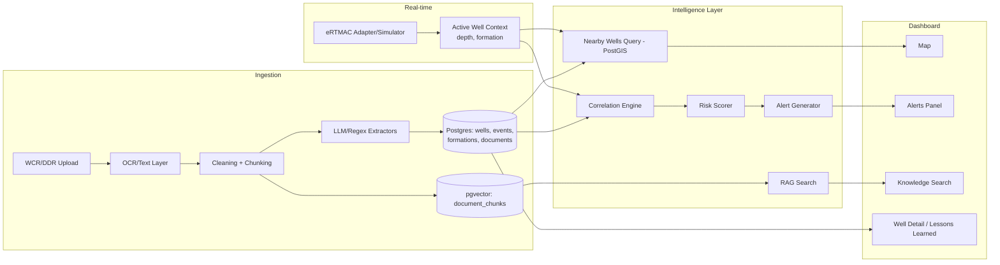

# NWIS — Nearby Wells Intelligence System
### Solution Blueprint for SIH26121 (Oil India Limited)

---

## 1. Problem Decomposition & Assumptions

**Root cause, not symptom:** the symptom is "engineers rediscover known hazards." The root cause is that historical operational knowledge (WCRs/DDRs) is *unstructured, unindexed, and not linked spatially or by depth/formation* to the well currently being drilled. eRTMAC solves real-time telemetry; it does not solve institutional memory.

**Assumptions (explicitly stated, not invented as OIL fact):**
- eRTMAC exposes at minimum a current-depth/current-formation value per active well, reachable via an internal API or a simulated feed for demo purposes — no real eRTMAC API is assumed to exist publicly, so NWIS is built with a pluggable adapter and a simulator behind it.
- WCR/DDR documents are per-well PDFs, some scanned, containing a narrative "Daily Drilling Report" style body plus semi-structured header tables.
- No real historical incident dataset is available for the hackathon — synthetic data (Module 7 in the existing plan) is the source of truth for the demo, generated with deliberately overlapping incidents so correlation has something real to show.
- NWIS is advisory only. It never issues a control action to drilling equipment, and every alert must be traceable to source documents.

---

## 2. End-to-End Architecture

This matches the module plan already drafted (Modules 0–7): Module 7 seeds data, Module 1 ingests it, Modules 2–3 expose it, Module 4→5 turns it into risk and alerts, Module 6 assembles the UI. Nothing here contradicts that plan — this section makes the *why* explicit for judges.

---

## 3. Ingestion & OCR Pipeline

Two-path pipeline, chosen for cost and reliability rather than a single "OCR everything" approach:

| Step | Decision | Why |
|---|---|---|
| Text-layer probe | pdfplumber/PyMuPDF first | Most DDRs are born-digital; OCR is slower and lossier — only pay that cost when needed |
| Scanned fallback | Tesseract, page-by-page, confidence stored | Confidence score lets low-quality pages be flagged instead of silently trusted |
| Header/footer strip | Detect lines repeating across ≥60% of pages | WCR templates repeat boilerplate that pollutes chunk embeddings |
| Unit normalization | Regex table: `mtrs`/`m`/`metres` → `m` | Downstream depth-regex and cross-well matching both depend on one unit token |

Async processing (upload returns `doc_id` immediately, OCR/extraction runs as a background job) is a deliberate scale decision: a 20-page scanned WCR can take 30–60s to OCR, and blocking the HTTP request on that is a bad demo experience.

---

## 4. Structured Extraction Schema

Extraction is decomposed by extractor (already specified in Module 1.4), each independently testable and each validated through a **Pydantic schema gate before any DB write** — this is the single most important reliability decision in the system: a malformed LLM output is never allowed to reach the database silently.

| Extractor | Output | Validation rule |
|---|---|---|
| Well metadata | name, spud_date, operator | Fuzzy-matched against existing `wells` table |
| Depth-event | event_type (enum), depth, description | `event_type` must be in fixed enum; else `needs_review` |
| Formation/lithology | formation, top_depth, bottom_depth | top < bottom, no overlap within same well |
| Incident/NPT | cause, depth, mitigation, outcome | Feeds `lessons_learned` feed directly |

On any validation failure, the raw LLM output and the error are stored, `extraction_status = needs_review` — **never silently dropped.** This is also the honest answer to a judge asking "what if the AI is wrong": the system is designed to surface uncertainty, not hide it.

---

## 5. Database Design

Single PostgreSQL instance with PostGIS + pgvector — deliberately *not* a separate vector DB (Chroma) or graph DB, because a 36-hour build window does not justify managing three databases when hybrid SQL+vector+geo queries are natively expressible in one.

| Entity | Key fields | Notes |
|---|---|---|
| `wells` | well_id PK, geom `geography(Point)`, status | geography type, not raw floats — accurate `ST_DWithin` |
| `well_formation_intervals` | well_id FK, formation, top/bottom depth | child table, many-per-well |
| `events` | event_id PK, well_id FK, depth, event_type, severity, source_document_id FK | source_document_id is the traceability anchor |
| `documents` | doc_id PK, well_id FK, ocr_status, extraction_status, raw_extracted_text | pipeline-state tracking |
| `document_chunks` | chunk_id, doc_id FK, chunk_text, `embedding vector(dim)` | RAG source |
| `alerts` | alert_id PK, well_id FK, risk_type, confidence, contributing_wells[] | array of well_ids for explainability |

This is unchanged from the plan already worked out — it is repeated here so the blueprint is self-contained for anyone who wasn't in the original planning thread.

---

## 6. RAG / Search Architecture

**Hybrid search, not pure vector search:** `WHERE well_id IN (nearby_wells) AND formation = 'X' ORDER BY embedding <-> query_embedding LIMIT 5`. Pure vector search over all wells would surface geologically irrelevant matches from a well 400km away; the metadata filter (from the PostGIS nearby-wells query) is applied *before* ranking, not after.

Synthesis prompt requires the LLM to cite `well_id`/`doc_id` per fact, parsed on the backend into clickable source chips — this is a **retrieval-grounded answer, not a free-generation answer**, which matters directly for the "trust" question judges will ask.

---

## 7. Cross-Well Correlation Methodology

Given the active well's current `(depth, formation)`:
1. Find nearby wells via PostGIS radius query.
2. Query their `events` where `depth` falls within a matching band (e.g. ±100m) **and** formation matches.
3. Group by `event_type`, count distinct wells affected.

This is deterministic SQL, not an LLM call — correlation must be reproducible and auditable, so it is kept out of the LLM layer entirely. The LLM's job is extraction and synthesis; the LLM is never asked to *decide* whether a pattern is real.

---

## 8. Risk Scoring & Predictive Approach

**Baseline (what actually gets demoed): rule-based, not ML.**

| Condition | Risk level |
|---|---|
| 1 nearby well had this event_type in this depth/formation band | Low — informational |
| ≥2 wells | Medium |
| ≥3 wells | High |

**Why not a trained model for the hackathon:** with only synthetic data (~5–8 wells), a logistic regression or any learned model would be fit to fabricated patterns and presented as "real ML" — that is actively misleading to judges and to a real engineer. The rule-based threshold is stated as a **conscious, defensible scope cut**, with a clearly labeled stretch path (Module 4.4): once a real historical dataset of ~50+ labeled events exists, a logistic regression over `(depth, formation, mud weight) → event_type probability` is a reasonable next step — not deep learning, which would overfit further on the same insufficient data.

---

## 9. Real-Time Integration with eRTMAC

NWIS does not assume a specific eRTMAC API contract (none is publicly available to design against). Instead:

- **Adapter interface**: `get_active_well_context(well_id) -> {depth, formation, timestamp}` — one function, swappable implementation.
- **Demo implementation**: Module 6.3's simulated live-depth feed (auto-increment or slider) stands in for the real feed.
- **Production path**: the same interface is implemented against OIL's actual eRTMAC stream once access is available — this is flagged as an integration risk (Section 19), not a solved problem.

NWIS is explicitly a **complement, not a replacement**: eRTMAC still owns real-time telemetry; NWIS only consumes a depth/formation signal from it and returns historical context.

---

## 10. Alert Generation & Explainability

An alert is only created when risk_level ≥ medium **and** no alert already exists for that well+depth-band (avoids alert spam as depth increments). Every alert stores `contributing_wells[]` and the `event_ids` that triggered it, and `recommended_mitigation` is **retrieved verbatim from the historical `mitigation_taken` text of the closest past event — not LLM-generated** — because a fabricated mitigation recommendation in a drilling-safety context is a genuinely dangerous class of error. Retrieval-only recommendation is a safety decision, not a shortcut.

---

## 11. Dashboard UX

| Zone | Content |
|---|---|
| Left | Map: active well, nearby wells, radius slider, risk color-coded markers |
| Center | Active well panel: live/simulated depth + formation |
| Right | Alerts panel: banner on new alert, expandable to show contributing wells/events |
| Bottom tab | Knowledge search: query box, synthesized answer, expandable sources |
| Well detail page | Full event history + linked source document excerpts |

**Critical demo journey:** engineer opens dashboard → advances simulated depth slider → alert banner fires → clicks alert → sees "3 nearby wells hit mud loss near 2510m in Formation X" with source documents → this is the single moment that proves the whole system, and it should be rehearsed as the literal demo script.

---

## 12. Recommended Stack

| Layer | Choice | Why |
|---|---|---|
| Backend | FastAPI (Python) | async-native, Pydantic validation built in, matches Module 0.5 plan |
| DB | PostgreSQL + PostGIS + pgvector | one database for relational + geo + vector, minimal ops overhead |
| OCR | Tesseract via pytesseract | free, offline, confidence scores available |
| Embeddings/LLM | Any hosted embedding model + Claude/GPT for extraction & synthesis | swap-in via a thin service layer |
| Map | Leaflet + OpenStreetMap | no API key required — zero setup risk on demo day |
| Frontend | React | matches team's likely familiarity, pairs with Leaflet |
| Deployment | Docker Compose (dev) | single-command spin-up for judges/reproducibility |

---

## 13. APIs & Major Components

| Router | Key endpoints |
|---|---|
| `wells` | `GET /wells/{id}/nearby?radius_km=`, well CRUD |
| `documents` | `POST /documents/upload`, `GET /documents/{id}/status` |
| `events` | query-by-well, query-by-depth |
| `search` | `POST /search` (hybrid RAG) |
| `alerts` | `GET /alerts/{well_id}` (polling — no websockets, deliberate scope cut) |

Health check (`/health`) first, always — trivial but the fastest way to catch a broken deploy before judging.

---

## 14. Security, Auditability, Deployment

- **Auth**: skipped for the hackathon demo (single-session, internal tool) — documented as a conscious cut, not an oversight. If time permits, one hardcoded API-key middleware.
- **Auditability**: every `event` row carries `source_document_id`; every `alert` carries `contributing_wells[]`/`event_ids`. This *is* the audit trail — traceability was designed in from Module 0, not bolted on.
- **Deployment**: local Docker Compose is sufficient and appropriate for a 36-hour build; production hardening (real auth, secrets management, TLS) is explicitly Phase-4/out-of-scope for the demo.

---

## 15. Handling Missing, Contradictory, or Low-Confidence Data

- Composite confidence = f(OCR confidence, LLM extraction confidence, regex-match certainty) → below-threshold extractions land in a visible "needs review" list rather than being written to `events` as if certain.
- Duplicate events (same incident mentioned in both WCR and DDR) are flagged by `(well_id, depth±5m, event_type)` proximity, not silently merged.
- Contradictory formation depths (overlapping ranges) fail the validation gate outright and are queued for manual correction.

The consistent principle: **uncertainty is surfaced, never hidden or auto-resolved.**

---

## 16. MVP vs Advanced Features

| MVP (build first) | Advanced (only if time remains) |
|---|---|
| Modules 7, 0, 1.1–1.4.3, 2, 3 (without hybrid filter nuance), 4.1–4.3, 5, 6.1–6.3 | Mud/casing extractor (1.4.4), statistical risk model (4.4), websocket alerts, auth |

---

## 17. Implementation Roadmap (36-hour framing)

1. **Hours 0–6:** Module 7 (synthetic data) + Module 0 (schema, FastAPI skeleton, Postgres/PostGIS/pgvector up) — nothing else can start without this.
2. **Hours 6–16:** Module 1 (ingestion + extraction) in parallel with Module 2 (map, since it only needs Module 0's well data).
3. **Hours 16–26:** Module 3 (search) and Module 4→5 (correlation, alerts) built off Module 1's output.
4. **Hours 26–34:** Module 6 (dashboard integration of everything above) — the simulated live-depth demo moment is the priority inside this window.
5. **Hours 34–36:** Rehearse the demo script from Section 11, fix the one thing most likely to break live.

---

## 18. Evaluation Metrics & Demo Strategy

- **Extraction accuracy**: % of manually-checked synthetic events correctly extracted (report this number honestly — it is a strength, not a weakness, to show a real evaluation).
- **Correlation demo**: the 2–3 hand-planted overlapping incidents (Module 7.3) must visibly surface as a "medium/high risk" alert — this is the make-or-break demo moment, not an optional nice-to-have.
- **Query latency**: report actual `/search` response time — judges respond well to a real number over a claim.
- **Demo script**: open on the map → advance the depth slider → alert fires → open alert → show contributing wells and source excerpt → run one natural-language search question live.

---

## 19. Key Technical Risks & Mitigations

| Risk | Mitigation |
|---|---|
| No real eRTMAC access/API for real integration | Adapter pattern + simulator, explicitly framed as the production integration point, not solved for the demo |
| Synthetic data reads as fake to judges | Deliberately grounded overlaps (Module 7.3) + honest labeling ("synthetic dataset, real architecture") |
| LLM extraction unreliable on messy scanned text | Confidence scoring + `needs_review` queue, never silent failure |
| Scope creep in a 36-hour window | MVP/advanced split (Section 16) stated up front and defended if asked |
| Presenting a rule-based risk score as "AI prediction" | Explicitly label it "rule-based correlation," reserve "ML" language only for the clearly-scoped Section 8 stretch goal |

---

## 20. Worked Example

Engineer is drilling Well-7, currently at 2480m, approaching a known formation boundary. As the simulated depth feed ticks to 2500m:

1. Correlation engine queries nearby wells (radius 5km) for events in this formation within ±100m of 2500m.
2. Finds 3 offset wells (Well-2, Well-4, Well-9) all logged `mud_loss` events in this band.
3. Risk scorer returns `high` (≥3 wells threshold met).
4. Alert created: *"High risk of mud loss near 2500m in Formation X — based on 3 nearby wells."*
5. Engineer expands the alert → sees each contributing well, its `mitigation_taken` text pulled verbatim from the historical DDR, and a link to the source PDF excerpt.
6. Engineer separately asks the search bar: *"What mitigation worked for mud loss in this formation?"* → gets a synthesized, source-cited answer pulling from the same three wells.

This is the single flow that demonstrates every layer of the system — ingestion → correlation → risk → alert → explainability — end to end.

---

*This blueprint builds directly on the module breakdown (Modules 0–7) and problem statement already drafted for SIH26121, adding the architectural reasoning, trade-offs, and demo strategy needed to present and defend the system.*
