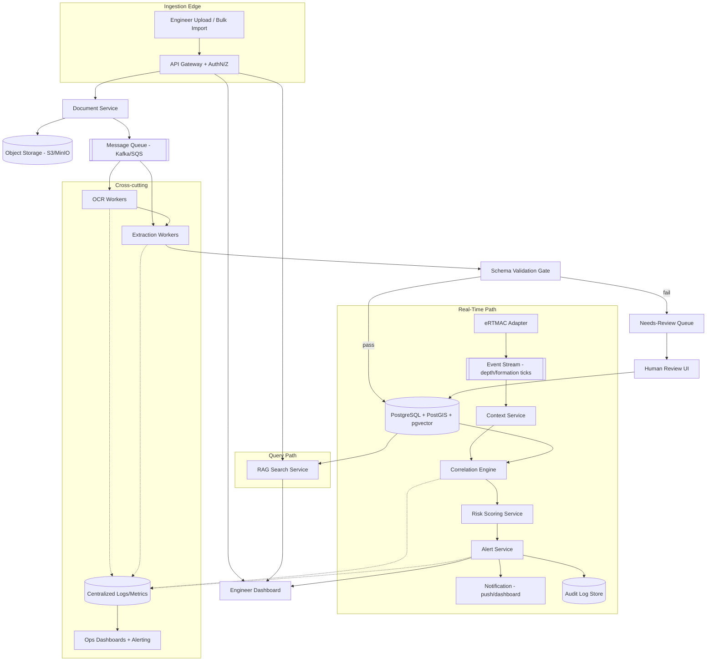
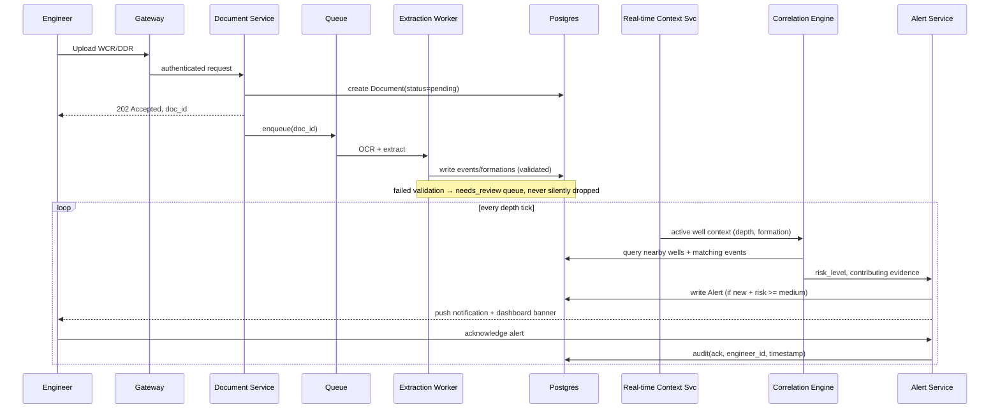

# NWIS — Production Architecture
### Enterprise Redesign for Oil India Limited (builds on the SIH26121 hackathon blueprint)

**Reading key:** 🔵 confirmed/stated fact · 🟡 assumption (explicitly flagged) · ⚪ proposed architecture · 🟣 future capability, not built yet.

---

## 1. Executive Architecture Summary

The hackathon prototype proved the *concept*: WCR/DDR text can be extracted, geospatially linked, correlated, and turned into a source-grounded alert. It is not production-ready in five specific ways, each corrected below: (1) no auth/RBAC, (2) no durable job/event pipeline — synchronous-ish background tasks won't survive a restart, (3) no data governance/provenance versioning, (4) risk scoring is a demo heuristic with no validation methodology, (5) no observability, DR, or deployment story. This document redesigns each while **preserving** what was already correct: single Postgres+PostGIS+pgvector store, deterministic correlation kept out of the LLM, retrieval-only mitigation text, and NWIS as advisory-only alongside eRTMAC. 🟡 Everything about real eRTMAC APIs, OIL's internal infra, and any historical incident data remains an assumption — none of it is confirmed and the architecture uses adapters specifically so it doesn't need to be.

---

## 2. Step 1 — Production Problem Definition

**Users:** field drilling engineers (primary, time-pressured, need answers in seconds not minutes), office-based drilling superintendents (secondary, need audit/history views), data/HSE teams (tertiary, need extraction quality and incident review queues).

**NWIS vs eRTMAC — explicit boundary:**

| | eRTMAC | NWIS |
|---|---|---|
| Owns | Live sensor telemetry, control-adjacent data | Historical document knowledge, cross-well correlation |
| Latency class | Sub-second, safety-relevant | Seconds, advisory |
| Failure mode if down | Operationally serious — out of scope here | Degrades to "no historical context available," never blocks drilling |

**Availability requirement (🟡 proposed, not OIL policy):** NWIS should target high availability during active drilling shifts but is explicitly **not** classified as safety-critical infrastructure — its outage must never be conflated with an eRTMAC outage. This one distinction drives most of the DR design in Section 10.

**Safety boundary (non-negotiable, carried from the prototype and hardened here):** NWIS never issues control actions, never auto-generates a mitigation recommendation via LLM, and every alert requires an engineer to acknowledge before it's considered "seen." No output is a substitute for engineering judgment.

**Data governance:** WCR/DDR documents may contain commercially sensitive well data — production requires role-based access at minimum (by field/asset, not just by user), full audit logging of who viewed which well's data, and a defined retention/amendment policy (Section 5).

---

## 3. Step 2 — Production Architecture

**What changed from the prototype and why:**

| Prototype | Production | Reason |
|---|---|---|
| Sync-ish background task on upload | Kafka/SQS-backed workers | Survives restarts, gives retry/DLQ, decouples ingestion spikes |
| Files on local disk | Object storage (S3/MinIO) | Durability, versioning, lifecycle policies for retention |
| No auth | Gateway-level AuthN + RBAC by field/asset | Governance requirement (Section 1) |
| Single monolith FastAPI | Service boundary at Document / Context / Correlation / Risk / Alert / Search | Independent scaling and failure isolation — a slow OCR burst must not affect alert latency |
| No audit store | Append-only audit log, separate from operational DB | Auditability must survive operational DB issues/rollbacks |

**Knowledge graph — evaluated and rejected for now:** a graph DB (well→formation→event relationships) was considered. ⚪ Verdict: not justified yet. Every relationship NWIS currently needs (well↔formation, well↔event, well↔nearby-well) is expressible as SQL joins + PostGIS distance, and a graph DB adds an operational component without a query pattern that actually requires graph traversal (e.g., multi-hop "operators who worked wells that share a supplier" — not a current requirement). Revisit only if a genuine multi-hop query emerges.

---

## 4. Detailed Data Flow

---

## 5. Database & Data Model (production hardening)

Core entities from the prototype (`wells`, `events`, `well_formation_intervals`, `documents`, `document_chunks`) are preserved. Added for production:

| New/changed field | On | Purpose |
|---|---|---|
| `provenance_id`, `extractor_version`, `model_version` | `events`, `well_formation_intervals` | Every derived fact traceable to *which* pipeline version produced it — essential when extractors are updated |
| `confidence_score` (0–1) | `events` | Drives the human-review threshold (Section 6), not just a display value |
| `superseded_by_event_id` (nullable FK to self) | `events` | Amended DDRs: an event is never overwritten in place — the correction is a new row linked to the one it supersedes, preserving history |
| `valid_from` / `valid_to` | `events`, `well_formation_intervals` | Bi-temporal-lite: supports "what did we believe on date X" without a full bitemporal engine |
| `retention_until`, `data_classification` | `documents` | Governance: retention policy and sensitivity tagging per document |
| `alerts.acknowledged_by`, `acknowledged_at` | `alerts` | Required for the audit trail in Section 7 |

**Conflicting reports:** two DDRs reporting a different depth for the same incident are **both kept** (never merged silently); a `duplicate_group_id` links likely-duplicates found by `(well_id, depth±5m, event_type)` proximity, and the review UI shows both side by side for a human to mark canonical. **Amended reports:** an amendment creates a new `document` row referencing the original via `amends_document_id`; extracted events from the amendment use `superseded_by_event_id` against the original's events rather than deleting them — deletion would destroy the audit trail. **OCR errors:** low per-page confidence (Tesseract score) below a configured threshold routes the whole document's extractions to `needs_review` regardless of extraction confidence, since a wrong OCR read poisons everything downstream of it.

---

## 6. AI/ML Architecture — Trustworthy-by-design

Five distinct mechanisms, kept explicitly separate so no single "AI" black box is making safety-relevant decisions:

| Mechanism | Used for | Never used for |
|---|---|---|
| **Deterministic rules** | Duplicate detection, risk-level thresholds (Phase 3), alert dedup | — |
| **Retrieval (vector + metadata filter)** | Search results, mitigation-text lookup | Generating new mitigation text |
| **Statistical model** (Phase 4, see Section 7) | Calibrated risk probability once enough labeled data exists | Deployment without a documented evaluation |
| **ML prediction** (Phase 4+, conditional) | Same as above, only if statistical model proves insufficient | Any output presented without a confidence interval |
| **LLM reasoning** | Structured extraction (schema-constrained), answer synthesis (source-cited) | Deciding risk level, inventing mitigations, or making any recommendation not directly traceable to a retrieved source |

**Human-in-the-loop gate:** any extraction below `confidence_score` threshold (⚪ proposed starting point 0.7, tunable) is routed to a review queue and **excluded from correlation/risk scoring until approved** — an unreviewed low-confidence event must not silently feed an alert.

**Drift monitoring (🟣 future, once a statistical/ML model exists):** track extraction-confidence distribution and risk-alert precision/recall against engineer feedback (did the engineer mark the alert useful?) over time; a sustained drop triggers model review, not silent auto-retraining.

---

## 7. Risk & Alert Architecture — staged evolution

The hackathon's "1/2/3 wells" rule is **kept as Phase-3's actual deployed logic** — not discarded, because it's honest, explainable, and appropriate until real data exists. What changes is what comes after it:

| Stage | Method | Requires | Deployed when |
|---|---|---|---|
| **Phase 3 (ship first)** | Deterministic threshold rule (as in prototype) | Nothing beyond extracted events | Immediately — it's explainable and auditable |
| **Phase 4a** | Statistically validated model (e.g. logistic regression, calibrated) | ≥50–100 labeled historical events with known outcomes, a held-out test set | Only after backtesting shows better precision/recall than the rule at matched false-positive rate |
| **Phase 4b (conditional)** | ML model (gradient boosted trees at most — not deep learning) | Enough data that Phase 4a's simpler model demonstrably underfits | Only with documented evaluation; **never claimed without evidence**, per the explicit constraint on this task |

**Evaluation methodology for 4a/4b:** time-based train/test split (not random — avoids leaking future incidents into training), report precision/recall/AUC plus a false-positive-cost discussion specific to drilling (a missed high-risk alert is far more costly than a false alarm, so the threshold is tuned toward recall, not accuracy). **Calibration:** reliability diagram checked before deployment — a model outputting "73% risk" must actually be right ~73% of the time at that band. **Safe deployment:** shadow mode first (model runs, logs predictions, does not fire alerts) for a defined evaluation window before it's allowed to trigger real alerts; rule-based Phase 3 stays live as a fallback throughout.

**Alert lifecycle:** `new → acknowledged → resolved`, severity `low/medium/high`, dedup by `(well_id, depth_band, event_type)` so re-triggering the same condition on every depth tick doesn't spam. Escalation (🟡 proposed): unacknowledged high-severity alert re-notifies after a configurable timeout — actual escalation policy (who, SLA) is an OIL operational decision, not one NWIS should hardcode.

---

## 8. eRTMAC Integration Design

Unchanged core decision from the prototype, hardened: a single adapter interface (`get_active_well_context`) is the only coupling point to eRTMAC, now explicitly event-stream-shaped rather than polled, so it can sit behind Kafka/SQS like everything else in the real-time path.

🟡 Since no real eRTMAC API is confirmed, production readiness for this integration is **explicitly gated** on an actual integration spec from OIL — this document proposes the adapter contract, not the eRTMAC side of it.

**Latency expectation (⚪ proposed target, not measured):** context-to-alert end-to-end under a few seconds is a reasonable advisory-tool target; this is *not* a safety-response-time requirement, consistent with NWIS's advisory classification in Section 1.

---

## 9. Security & Governance

| Control | Design |
|---|---|
| AuthN | OIDC/SSO integration (🟡 assumes OIL has a corporate IdP — standard for enterprise) |
| AuthZ | RBAC scoped by field/asset, not just role — a field engineer sees their fields' wells, not the whole basin |
| Encryption | TLS in transit; encryption at rest for object storage and DB (both standard managed-service defaults) |
| Secrets | Managed secrets store (Vault or cloud-native equivalent) — never in `.env` files committed to source, unlike the prototype's dev-only `.env` |
| Network | NWIS in a private subnet; eRTMAC adapter as the only egress point to OT-adjacent systems, reviewed by OIL's security team — NWIS should never be given broader OT network access than this one read path |
| Audit | Append-only audit log for every document view, alert acknowledgment, and admin action, retained per governance policy |

---

## 10. Reliability & Disaster Recovery

- **Backups:** automated Postgres backups (point-in-time recovery) + object storage versioning for source documents — the raw WCR/DDR must always be recoverable independent of extraction state, since extraction can be rerun but the source document cannot be regenerated.
- **HA:** stateless services (Document/Context/Correlation/Risk/Alert/Search) horizontally scaled behind the gateway; Postgres in a managed HA configuration (read replica for search/reporting load, separating it from the write path used by ingestion and alerting).
- **DR:** cross-region backup replication (🟡 proposed, RTO/RPO targets are an OIL business decision, not assumed here).
- **Explicit non-goal:** NWIS DR is scoped independently from eRTMAC DR — conflating the two would misrepresent NWIS as safety-critical, which Section 1 explicitly says it is not.

---

## 11. APIs & Event Contracts

| Contract | Shape |
|---|---|
| `POST /documents` | multipart upload → `{doc_id, status: "pending"}` |
| `GET /documents/{id}` | → status, confidence summary, needs_review flag |
| `GET /wells/{id}/nearby?radius_km=` | → well list with geo distance |
| `POST /search` | `{query, well_id?, formation?}` → synthesized answer + source chips |
| `GET /alerts/{well_id}` | → active + historical alerts, each with `contributing_wells`, `event_ids` |
| `POST /alerts/{id}/ack` | → audit-logged acknowledgment |
| Event: `well.context.updated` | `{well_id, depth, formation, ts}` — published by eRTMAC adapter |
| Event: `event.extracted` | `{event_id, well_id, confidence, status}` — published by extraction worker |
| Event: `alert.created` | `{alert_id, well_id, risk_level, contributing_wells}` — consumed by notification service |

All internal service-to-service communication moves from the prototype's direct function calls to these published events — this is what makes the OCR burst / alert latency independence in Section 3 actually true.

---

## 12. Observability & MLOps

- **Logging:** structured JSON logs with request IDs threaded through the whole pipeline (upload → OCR → extraction → correlation → alert), so a single `doc_id` or `alert_id` can be traced end to end.
- **Metrics:** extraction throughput/latency, OCR confidence distribution, queue depth, alert precision as rated by engineer feedback, search latency.
- **Model lifecycle (once Phase 4 exists):** versioned model artifacts, shadow-mode evaluation before promotion, rollback to the previous version on a metrics regression — never a silent auto-deploy.

---

## 13. Production Roadmap

| Phase | Deliverables | Depends on | Key risk | Out of scope |
|---|---|---|---|---|
| **1 — Foundation** | AuthN/RBAC, object storage, Kafka/SQS worker pipeline, hardened Postgres schema (Section 5) | Nothing (rebuild of prototype's foundation) | Underestimating governance/RBAC complexity | Real eRTMAC integration |
| **2 — Searchable institutional memory** | Full ingestion+extraction+RAG search, needs-review UI, audit logging | Phase 1 | OCR quality on real scanned archives (unknown until tested) | Real-time alerting |
| **3 — Real-time + explainable alerts** | eRTMAC adapter (against real spec once available), correlation engine, rule-based risk, alert lifecycle/dedup/ack | Phase 2 + confirmed eRTMAC contract | eRTMAC integration spec may not match assumptions here | Statistical/ML risk models |
| **4 — Validated statistical/ML risk** | Backtested statistical model, shadow-mode evaluation, calibration report | Phase 3 running long enough to accumulate ≥50–100 labeled events | Insufficient real incident data to validate | Deep learning (explicitly excluded) |
| **5 — Enterprise-scale optimization** | Read replicas, caching, multi-field/multi-basin scaling, cost tuning | Phase 3 in stable production use | Scaling before there's real usage data to scale for | — |

Acceptance criteria per phase are, respectively: RBAC enforced + zero direct-file-access paths; extraction accuracy measured against a labeled sample + search latency under target; alert precision rated acceptable by engineers over a pilot period; statistical model beats the rule at matched false-positive rate on held-out data; sustained load handled within defined SLOs.

---

## 14. Cost & Scalability Considerations

Dominant costs at scale are LLM extraction/synthesis calls and OCR compute — both mitigated by the prototype's already-correct decision to regex-prefilter before invoking the LLM (Section 1.4.2 in the original plan) and to only OCR pages that fail the text-layer check. Postgres+PostGIS+pgvector scales via read replicas for query load (search, dashboard reads) while keeping the write path (ingestion, alerts) on the primary — this single-database strategy remains appropriate at OIL's likely scale (dozens to low-hundreds of wells per basin) and should only be reconsidered if vector search volume specifically becomes a bottleneck a dedicated vector DB would solve.

---

## 15. Failure Scenarios & Mitigations

| Scenario | Mitigation | Detection |
|---|---|---|
| eRTMAC feed drops mid-shift | Context service surfaces "stale context" state, does not fabricate a depth; correlation pauses rather than running on stale data | Heartbeat metric on `well.context.updated` |
| Extraction worker crashes mid-document | Queue redelivery + DLQ after N retries; document stays `pending`, never falsely marked `done` | Queue depth/DLQ alert |
| Duplicate alert storm from rapid depth ticks | Dedup key `(well_id, depth_band, event_type)` | Alert-creation rate metric |
| Malicious/corrupt PDF upload | File-type/size validation at gateway, sandboxed OCR worker | Upload rejection logs |
| OCR misreads a critical depth digit | Confidence-threshold routing to `needs_review`; never auto-published on low confidence | Confidence-score distribution monitoring |
| Statistical model (Phase 4) drifts | Shadow-mode re-evaluation cadence; rollback to prior version or to rule-based fallback | Precision/recall tracked against engineer feedback |
| Search index (pgvector) query slow under load | Read replica routing for search traffic, separate from write path | Query latency metric |

---

## 16. Production-Readiness Checklist

- [ ] AuthN/RBAC enforced at gateway, scoped by field/asset
- [ ] All ingestion durable via queue, survives worker restart
- [ ] Every extracted fact has provenance (`extractor_version`, `source_document_id`)
- [ ] No event ever deleted — amendments/duplicates handled via linkage, not overwrite
- [ ] Low-confidence extractions excluded from correlation until reviewed
- [ ] Risk scoring stage matches actual validated evidence (never Phase 4 claimed without a backtest)
- [ ] Every alert has an audit trail: created → acknowledged → resolved, with identities and timestamps
- [ ] NWIS outage explicitly does not degrade eRTMAC or drilling operations
- [ ] Secrets in a managed store, not source-controlled config
- [ ] Backups cover both raw documents (object storage) and derived data (Postgres) independently
- [ ] Observability traces a single document/alert end-to-end via request ID
- [ ] Model deployment (Phase 4+) goes through shadow mode before live alerting

---

## 17. Step 10 — Challenge the Design (Skeptical Review)

**Drilling expert:** *"Why should I trust a mitigation suggestion from a system that reads old PDFs?"*
→ It never suggests one — `recommended_mitigation` is retrieved verbatim from a specific past DDR's `mitigation_taken` text, shown with its source. NWIS's claim is "here's what was recorded before," not "here's what you should do."

**Enterprise architect:** *"A single Postgres instance for relational + geo + vector — won't that become a bottleneck?"*
→ At OIL's realistic well-count scale this is deliberately simpler than a 3-database architecture, and the read/write-path split (Section 14) is the standard scaling lever before a database split is justified. Revisit only with measured evidence it's insufficient.

**Cybersecurity reviewer:** *"What's the blast radius if the eRTMAC adapter is compromised?"*
→ It is a single read-only egress point, reviewed by OIL's security team, in a private subnet, with no write-back path to OT systems — NWIS is designed to only ever *consume* a depth/formation signal, never send anything back.

**Safety reviewer:** *"What stops an unreviewed, wrong extraction from triggering a false alert that an engineer then ignores real risk because of?"*
→ Confidence-threshold gating excludes unreviewed low-confidence events from correlation entirely (Section 6); alert dedup and severity levels are deterministic and auditable; no ML risk claim ships without a documented backtest (Section 7). The consistent design principle across every layer is "surface uncertainty, don't hide or resolve it silently" — carried forward from the prototype and enforced more strictly here.

---

*This document supersedes the hackathon blueprint's operational assumptions (auth, deployment, risk-model claims) while preserving its architecturally sound decisions (single hybrid database, deterministic correlation, retrieval-only mitigation text, advisory-only scope). Anything marked 🟡 or 🟣 above requires confirmation from OIL before being treated as settled.*
